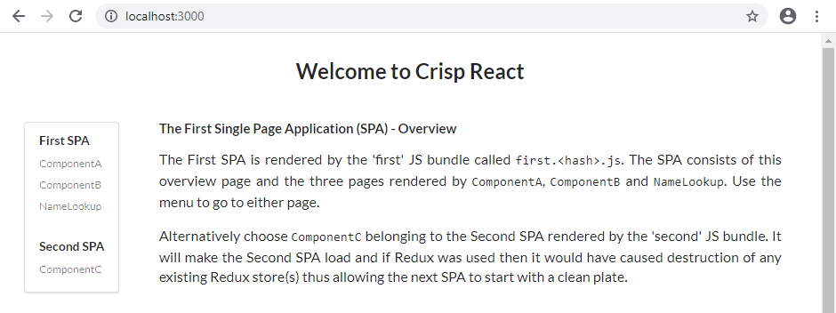
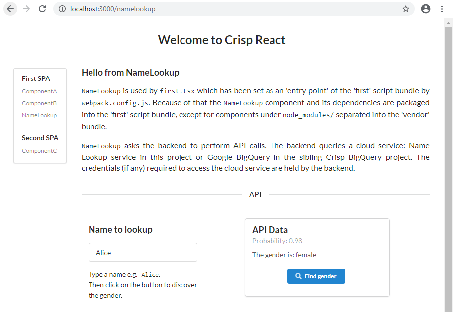

<div align="center">
  <a href="https://crisp-react.winwiz1.com">
    
  </a>
  <br />
  <br />
</div>

## Project Highlights
Crisp React can optionally split a monolithic React app into multiple Single Page Applications (SPAs) and selectively prerender the landing/index page of any SPA at the build time. This innovative flexibility can offer the best performance for many websites, more about it later. Yet it doesn't come at the price of complicating the solution which remains as simple as a React application could possibly be.

For example, the Router is arguably one of the most important SPA components because it drives the application by controlling its page switching. Crisp React doesn't use a custom Router, in each SPA the routing is managed by a separate instance of [React Router](https://reactrouter.com/) which is the de facto standard for React SPAs.

The value offered by Crisp React is not limited to performance. On the one hand, the value comes from what this solution doesn't bring about. There is no need to learn a framework, depend on it and use non-portable programming constructs in the React components you write, therefore no vendor lock-in. On the other hand, the list of useful features includes:
### SEO and SPA
On the contrary to popular belief that SEO requires SSR, this solution innovatively demonstrates how to get all SPA pages indexed by Google and specific, targeted SEO advice on how to achieve indexing is provided.

More details are available from the [SEO](#seo) section.
### Performance
The performance is achieved by:
* Splitting React app into multiple SPAs, each rendered by its own and smaller script bundle that can be downloaded faster.
* The landing/index page of any SPA can be prerendered at the build time to let a browser build the DOM without waiting for the bundle to be downloaded, parsed and executed.
* Standard Webpack techniques such as tree shaking, script bundle minification and compression.
* Long term caching of script bundles in the browser cache.
    > To achieve smooth rollout of versioning changes, only bundles are cached client-side. HTML files are not. The risk of old bundles getting stuck in the cache is eliminated by bundle fingerprinting (its name includes the build hash).

This topic is covered further in the [separate section](docs/benchmarks/PERFORMANCE.md#performance). It provides more insight into the performance related issues along with benchmarking results.
### Full Stack and Jamstack Builds
The solution provides full stack deployments with several cloud vendors yet again avoids vendor lock-in by reusing the same Docker container. This is complemented by Jamstack deployments that aim for simplicity and speedy production release. All deployments achieve high test scores from reputable online testing tools like [web.dev/measure](https://web.dev/measure) and [webpagetest.org](https://webpagetest.org).

<table width=100%>
  <tr>
    <th width=15%>Build option</th>
    <th width=35%>What it does</th>
    <th width=50%>Sample builds</th>
  </tr>
  <tr>
    <td>Full stack</td>
    <td>Builds React app and backend.  The latter serves static app files and API responses to end users.<br/> Although in many production deployments the static files would be served to a CDN instead.<br/>Having one server instead of two (one for frontend, another for backend) reduces the attack surface of the deployment, brings down its costs, complexity and delivers other benefits like CORS avoidance.</td>
    <td><ul><li>Google Cloud Run: Click on the button provided in the relevant section.  Then wait until the build finishes in the cloud and access the website. Fast :clock2: and simple build.</li><li>Heroku: Execute several commands from your Terminal and get the website running. Simple build but takes :clock5: a while. Free :coffee: deployment option.</li><li>Google Compute Engine: More complex :scroll: and potentially very secure :lock: deployment with a series of commands to execute and without any software that needs to be installed.</li></ul></td>
  </tr>
  <tr>
    <td>Jamstack</td>
     <td>Builds the React app only. The build artifacts are served to end users by the webserver supplied by a Jamstack vendor.<br/>Since the demo project has no backend, the API calls go directly to the cloud service.<br/>In production the API calls could target endpoints implemented by AWS API Gateway or similar infrastructure.</td>
      <td><ul><li>Cloudflare Pages: Provide just a few simple pieces of data using the configuration screen presented by Pages. Then get a website built and deployed in the cloud. Fast :clock2: and simple build with free :coffee: deployment option.</li><li>AWS S3: More complex :scroll: deployment. Build the website locally and copy build artifacts to a cloud bucket while completing a series of manual deployment steps.</li></ul></td>
  </tr>
</table>

### Code Splitting.
Based on the ability to optionally split your React application into multiple Single Page Applications (SPA). For example, one SPA can offer an introductory set of screens for the first-time user or handle login. Another SPA could implement the rest of the application, except for Auditing or Reporting that can be catered for by yet another SPA. This approach would be beneficial for medium-to-large React applications and can be combined with other code splitting techniques - see [Q & A](docs/Q&A.md#dynamic-imports) section.
### Simplicity
Smaller codebase and slim building machinery translate into less maintenance burden and easy troubleshooting. The other (e.g. development) side of this coin is also bright: Adding third-party libraries will less likely cause incompatibility with existing software. Simplicity coupled with absence of non-portable properties, opinionated data fetching hooks etc. means there is less room for the incompatibility issues to develop, less potential friction points.

The amount of code that any Github repository contains can be measured using the link: `https://img.shields.io/github/languages/code-size/<owner-name>/<repo-name>`. For Crisp React, the amount of code is currently around 135 kB and is shown by the code size badge. The client and the server subprojects each contribute ~50% of the codebase. The latter is used in full stack builds only.
### CSS
The following CSS handling approaches can be used:

| Approach | Advantages | Disadvantages
|:---:|:---|:---|
|Plain CSS|Simplicity.<br/>Performance.|Several React components can have rules with the same class selector names. It creates collisions that need to be tracked manually.|
|CSS Modules|Performance.<br/>Name collisions resolved automatically.<br/>Support for rule reuse via composition.|Rule duplication (if undetected) increases the size of the resulting stylesheet.|
|LESS|Rich functionality.|Learning curve exists.<br/>Potential for overengineering.
|CSS-in-JS|Productivity.<br/>Learning curve minimal with basic CSS knowledge.<br/>Helps to create self-contained components.<br/>CSS handling logic could be sophisticated, depend on run-time data etc.|Script dependency results in loading delays.<br/> If used unwisely (e.g. for a rule that affects page layout), can trigger Cumulative Layout Shift (CLS). The CLS could be visible to users as a sudden and unpleasant page movement or layout adjustment.<br/>Loss of JSX code portability.<br/>The chosen library, namely Emotion, is not Atomic, so rule duplication is an issue.|

### Enterprise Options
The options include:
* Intellectual Property protection,
* RBAC augmentation,
* Website partitioning for development in parallel by several teams or developers,
* Maintenance self-sufficiency.

 The first two options are [based](docs/WhenToUse.md#case-enterprise-requirements) on making the script bundle download conditional. This functionality is not implemented to keep the codebase slim but can be added for both Jamstack and full stack builds by utilising solutions like [Auth0](https://auth0.com)  or [PassportJS](https://www.npmjs.com/package/passport).

The third option uses a SPA as a unit of planning, development and acceptance. For example, you can have a Login SPA, Main SPA, Reporting SPA, Audit SPA, Admin SPA, etc.

The last option is based on [Simplicity](#simplicity) and means that when a dependency is updated, for example to fix a security vulnerability, you don't have to wait for an external maintainer to include the updated version into Crisp React. You can execute `cd server; yarn upgrade xxx --latest` on the cloned repository yourself.
### Seamless Debugging.
Debug a minified/obfuscated, compressed production bundle and put breakpoints in its TypeScript code using both VS Code and Chrome DevTools. Development build debugging: put breakpoints in the client and backend code and debug both simultaneously using a single instance of VS Code. The specific instructions are available under the [Scenarios](#scenarios) heading.

---
[The addendum](docs/WhenToUse.md#when-to-use) lists a few cases that answer the question “When use this solution”. It also addresses the opposite e.g. “When not to use it”.

## Table of Contents
- [Getting Started](#getting-started) 
- [Features](#features)
  - [SPA Configuration](#spa-configuration)
  - [CSS Handling](#css-handling)
    - [Plain CSS](#plain-css)
    - [CSS Modules](#css-modules)
    - [LESS](#less)
    - [CSS-in-JS](#css-in-js)
- [Testing](#testing)
- [Usage - Jamstack](#usage---jamstack)
  - [Cloudflare Pages](#cloudflare-pages)
  - [AWS S3](#aws-s3)
- [Usage - Full Stack](#usage---full-stack)
  - [Docker](#docker)
  - [Heroku](#heroku)
  - [Google Compute Engine](#google-compute-engine)
  - [Cloud Run](#cloud-run)
- [Scenarios](#scenarios)
  - [Client Usage Scenarios](docs/Scenarios.md#client-usage-scenarios)
  - [Backend Usage Scenarios](docs/Scenarios.md#backend-usage-scenarios)
- [Custom Domain and CDN](#custom-domain-and-cdn)
- [SEO](#seo)
  - [Goals](#goals)
  - [Prerequisites](#prerequisites)
  - [Groundwork](#groundwork)
  - [Requesting To Be Indexed](#requesting-to-be-indexed)
  - [Structured Data](#structured-data)
- [What's Next](#whats-next)
- [Pitfall Avoidance](#pitfall-avoidance)
- [Q & A](#q--a)
- [License](#license)

## Getting Started
### Full Stack
Install `yarn` if not already installed: `npm install yarn -g`

<div>
  <details>
    <summary><strong>With VS Code</strong></summary>
    <br />
    Prerequisites: Chrome and VS Code with 'Debugger for Chrome' extension.<br/><br/>
    <ul>
      <li>Clone the <code>crisp-react</code> repository:<br/>
        <br/>
        <code>git clone https://github.com/winwiz1/crisp-react.git</code><br/>
        <code>cd crisp-react</code><br/>
        <br/>
      </li>
      <li>Install dependencies:
        <p>
          <code>yarn install</code>
        </p>
      </li>
      <li>Open the workspace file in VS Code:
        <p>
          <code>code ./crisp-react.code-workspace</code>
        </p>
      </li>
      <li>Start the debugging configuration <code>'Debug Client and Backend (workspace)'</code>.</li>
      <br/>
      <li>Wait until an instance of Chrome starts. You should see the Overview page:
        <p>
          
        </p>
        <br/>
      </li>
      <li>Choose the <code>NameLookup</code> component from the menu. You should see its page:
        <p>
          
        </p>
        <br/>
      </li>
      <li>Stop the running debugging configuration (use the 'Stop' button on VS Code Debugging toolbar two times or press <code>Control+F5</code> twice).</li>
    </ul>
  </details>
</div>
<div>
  <details>
    <summary><strong>Without VS Code</strong></summary>
    <br />
    After executing the following commands:<br/>
	<br/>
    <code>  git clone https://github.com/Kokosik132/React_Boilerplate.git</code><br/>
    <code>  cd crisp-react</code><br/>
    <code>  yarn install && yarn start:prod</code><br/>
    <br/>
    you will have a running instance of backend (e.g. Express) serving the newly built React app that can be seen by pointing a browser to <code>localhost:3000</code>.<br/>
    Terminate the backend by pressing <code>Control+C</code>.
  </details>
</div>

The section can be concluded by optionally renaming the solution. Rename the top-level directory from `crisp-react` to `your-project` and set the `SPAs.appTitle` variable in the [`spa.config.js`](client/config/spa.config.js) file accordingly. Ignore the rest of the file for a moment, it's covered in depth in the [SPA Configuration](#spa-configuration) section.
### Jamstack
Use the configuration page presented by Cloudflare Pages to let Cloudflare build and deploy the solution. The details are provided under the [Cloudflare Pages](#cloudflare-pages) heading.
## Features
### SPA Configuration
The optional splitting of a React application into multiple SPAs (each rendered by its own bundle) improves the application  loading time. The `vendor` bundle contains `node_modules/` dependencies and is reused between SPAs so that there is no need to download it again when switching from one SPA to another.

Every SPA has a landing page displayed during initial rendering by the component included into the SPA. In webpack terminology such a component is called entry point. An SPA (and its bundle) is comprised of this component, the components it imports and their dependencies. Let's see how Crisp React defines the SPAs.
#### The SPA Configuration Block
The client subproject builds an application with SPAs defined by the SPA Configuration block in the [`spa.config.js`](client/config/spa.config.js#L47-L64) file:
```js
/****************** Start SPA Configuration ******************/
  var SPAs = [
    new SPA({
      name: "first",
      entryPoint: "./src/entrypoints/first.tsx",
      ssr: true,
      redirect: true
    }),
    new SPA({
      name: "second",
      entryPoint: "./src/entrypoints/second.tsx",
      ssr: false,
      redirect: false
    })
  ];
  SPAs.appTitle = "Crisp React";
/****************** End SPA Configuration ******************/
```
Each SPA is defined using 4 pieces of data: name, entry point (e.g. the landing page component) and two boolean flags. Ignore the flags for a moment. There is also an `appTitle`, it provides the application-wide default setting for the `<title>` tag in the `<head>` section of all pages. The title can be easily overwritten as needed.

SPA's name "first" is used to define the SPA's landing page e.g. `/first.html` and name the bundle that renders the SPA: `first<hash>.js`. More information about all the configuration data pieces is provided in the [configuration file](client/config/spa.config.js) comments. The file is copied during the backend build from the client subproject and used to configure the client, the backend and the unit tests.
#### Modifications
To reconfigure the application to have a separate SPA for login and another one for the rest of the application, change the SPA Configuration block as follows:
```js
/****************** Start SPA Configuration ******************/
  var SPAs = [
    new SPA({
      name: "login",
      entryPoint: "./src/entrypoints/login.tsx",
      ssr: true,
      redirect: false
    }),
    new SPA({
      name: "app",
      entryPoint: "./src/entrypoints/app.tsx",
      ssr: false,
      redirect: true
    })
  ];
  SPAs.appTitle = "DemoApp";
/****************** End SPA Configuration ******************/
```
and then follow the instructions provided in the configuration file comments.

Since any SPA is comprised of the landing page component (entry point) and its imports, the coding to support the SPA reconfiguration can start by making `login.tsx` render the login page: either directly or maybe with the help of an imported component that will ask for user credentials. Another component could render a page asking for alternative credentials e.g. biometrics or ask for multifactor authentication (MFA).

The entry point `app.tsx` would import the component responsible for rendering the page presented to the user after logging in. Express could potentially be modified to ensure only authenticated users can download the bundle for this SPA.

The newly written `app.tsx` should verify the client is logged in (for example by checking the cookie set by backend after successful login) and if not redirect to the landing page of the 'login' SPA: `/login.html`. In the same manner `login.tsx` should check if the client has been authenticated and if so redirect to `/app.html`. 

No modifications are required for the backend. It will be reconfigured to serve the two HTML pages, namely `/login.html` and `/app.html`, which are the landing pages of our two SPAs.

To turn off code splitting, simply leave one SPA in the SPA Configuration block.

> Tip: Let's assume over the time the application has grown and acquired extensive reporting capabilities, perhaps with a reporting dashboard that imports many components. In this case the third SPA and its entry point `reporting.tsx` can be added to the SPA Configuration block. The entry point would import the dashboard and use it for rendering. Such an addition would take little time but bring performance and development/testing benefits. For example, some tests can focus on a React application that has the reporting SPA as the only entry in the SPA Configuration block thus taking the rest of the application out of the testing scope.

```js
/****************** Start single SPA Configuration ******************/
  var SPAs = [
    new SPA({
      name: "index",
      entryPoint: "./src/entrypoints/first.tsx",
      ssr: true,
      redirect: true
    }),
  ];
  SPAs.appTitle = "Crisp React";
/****************** End single SPA Configuration ******************/
```

This SPA configuration block is a simplified version of the [default one](client/config/spa.config.js#L47-L64). It ensures the automatically generated HTML file is called `index.html` and makes integration with some vendors more straightforward. However this simplification is optional, Jamstack build supports multiple SPAs as demonstrated in the Cloudflare Pages example below.

The following command is used to build a Jamstack client:
```
yarn build:jamstack
```
After the command finishes, the build artifacts are located in the `client/dist/` directory ready to be served by the webserver supplied by a Jamstack provider.

Use the `yarn dev` and `yarn lint` commands executed from the `client/` directory to debug and lint Jamstack client.